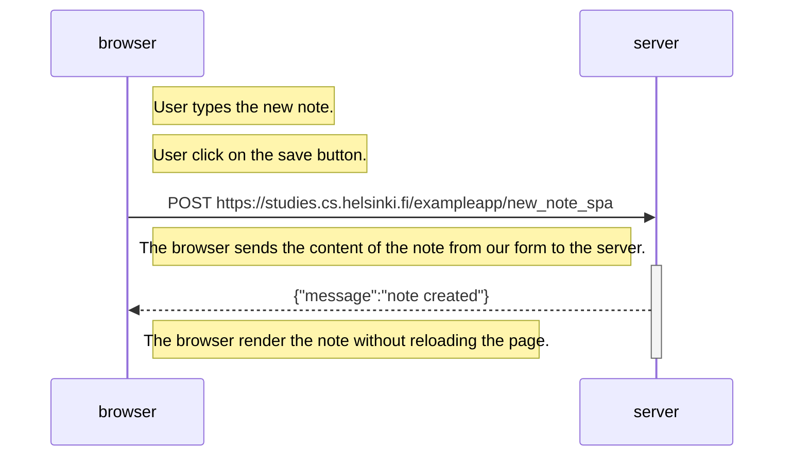

```mermaid
sequenceDiagram
    participant browser
    participant server

    Note right of browser: User types the new note.
    Note right of browser: User click on the save button.


    browser->>server: POST https://studies.cs.helsinki.fi/exampleapp/new_note_spa
    Note right of browser: The browser sends the content of the note from our form to the server.
    activate server
    server-->>browser: {"message":"note created"}
    Note right of browser: The browser render the note without reloading the page.
    deactivate server

```
